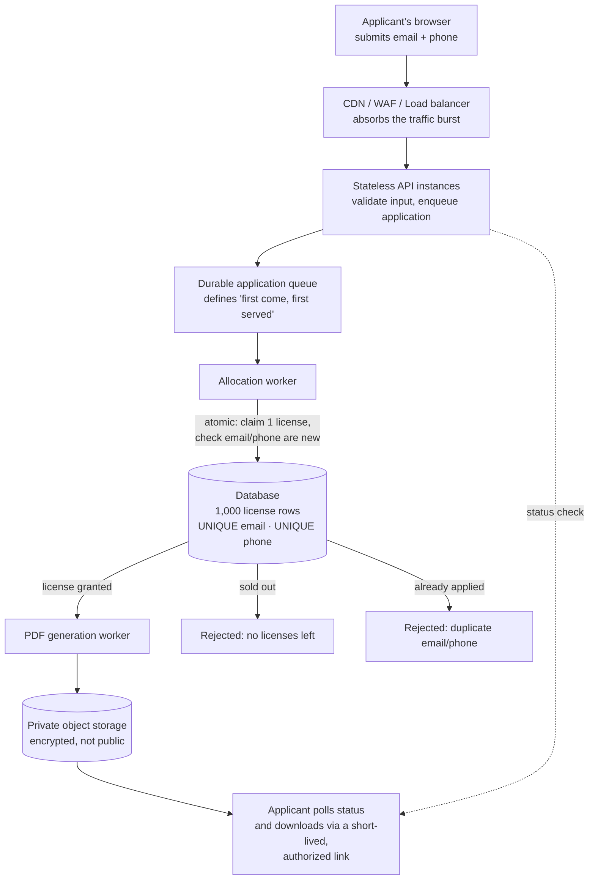

# Free License Give-Away

A solution to an interview brief: design and partially build the backend for a
give-away of exactly **1,000 free software licenses**, opened to the public all at
once. The brief is in [`Candidate_Brief_Free_License_Giveaway_1.pdf`](Candidate_Brief_Free_License_Giveaway_1.pdf).

## The problem, in plain terms

- 1,000 licenses exist. Not 999, not 1,001 — **exactly** 1,000 get handed out, ever.
- A person applies with just an email and a phone number. **One license per person**
  — the same email or phone can't collect a second one.
- Thousands of people are expected to apply within seconds of the campaign opening,
  so the system has to survive a huge burst of simultaneous requests without falling
  over or slowing to a crawl.
- Whoever applies first should, as much as is realistically possible, get served
  first.
- Each license is a PDF (a code plus a certificate). It's **secret** — only the
  person who earned it (and the company) should ever be able to open it.
- The applicant should see, in the UI, when their PDF is ready, and be able to
  download it.

## How it works



Walking it left to right: the **edge layer** (CDN/WAF/load balancer) takes the brunt
of the opening-moment traffic spike so it never reaches anything stateful. The **API**
does the minimum work possible — validate, then hand the request to a **durable
queue** — instead of doing the slow work inline; the order the queue durably accepts
requests in is this system's honest, defensible definition of "first come, first
served," since no distributed system can observe the literal instant someone clicked.
An **allocation worker** then does the one operation that actually matters: in a
single atomic database transaction, it checks the email and phone haven't been used
before, and claims exactly one license — this is what makes "exactly 1,000, never
more" hold up even with thousands of requests arriving at once. Once a license is
granted, PDF generation happens on a separate path so a slow or failed PDF job can
never cost someone their license. The finished PDF sits in private, encrypted
storage, and is only ever handed out via a short-lived, authorized link — never a
public URL. The applicant's browser polls a status endpoint to know when it's ready.

The full reasoning — why an in-memory counter would be wrong, how the atomicity race
is prevented, what "fair" actually means for a distributed system, how the PDF stays
secret, and how this would map onto AWS specifically — is in
[`docs/system-design.md`](docs/system-design.md).

## What's in this repository

| Path | What it is |
|---|---|
| [`Candidate_Brief_Free_License_Giveaway_1.pdf`](Candidate_Brief_Free_License_Giveaway_1.pdf) | The original interview brief. |
| [`docs/system-design.md`](docs/system-design.md) | Part A: the full production system design and reasoning behind it. |
| [`src/LicenseGiveaway.Api/Program.cs`](src/LicenseGiveaway.Api/Program.cs) | Part B: a C# ASP.NET Core minimal API implementing the application/allocation endpoint. |
| [`tests/LicenseGiveaway.Tests/LicenseAllocatorTests.cs`](tests/LicenseGiveaway.Tests/LicenseAllocatorTests.cs) | Unit tests for the allocation logic, including a 10,000-concurrent-request test proving exactly 1,000 succeed. |
| [`docs/interview-walkthrough.md`](docs/interview-walkthrough.md) | Speaking notes and anticipated Q&A for the live review call. |
| [`.claude/skills/senior-backend-engineer/SKILL.md`](.claude/skills/senior-backend-engineer/SKILL.md) | Reference notes used while preparing this solution. |

## Key design decisions

- **Exactly 1,000, never more.** The classic bug is two workers both seeing "1
  license left" and both allocating it. The fix is making the *decrement itself* the
  atomic, conditional database operation, not a separate read-then-write. See
  [`docs/system-design.md`](docs/system-design.md#exactly-1000).
- **No duplicate emails/phones.** Enforced by a database uniqueness constraint on
  normalized values, not just an application-level check — the constraint is what
  actually survives multiple servers handling requests concurrently at the same time.
- **Fairness is honest, not perfect.** No distributed system can observe true
  click-order. Fairness here means "the order the system durably accepted the
  request," which is a defensible definition, clearly stated as such rather than
  oversold.
- **The PDF is decoupled from allocation.** Generating and storing the certificate
  happens after the license is already committed, so a slow or broken PDF job can
  never cost someone a license or block the allocation path.

The coding exercise (Part B) deliberately uses in-memory state and a single lock
instead of a real database, because the brief explicitly allows that and says the
implementation doesn't need to be production-grade. Per a follow-up note from the
interviewer that an actual database isn't required, resolved applications are also
appended as JSON lines to a local placeholder file (`applications.jsonl`, git-ignored)
via an injectable callback — defaulting to a no-op so the unit tests stay fast and
in-memory-only. See [`docs/interview-walkthrough.md`](docs/interview-walkthrough.md)
for the trade-off discussion against making that file the actual consistency
boundary.

## Running it locally

Requires the .NET 8 SDK.

```bash
dotnet test
dotnet run --project src/LicenseGiveaway.Api
```

Then apply for a license:

```json
POST /applications
{
  "email": "alice@example.com",
  "phone": "+358401234567"
}
```

The queue, database, and PDF generation are represented by simple, clearly-labeled
stubs, as the exercise asks for.
